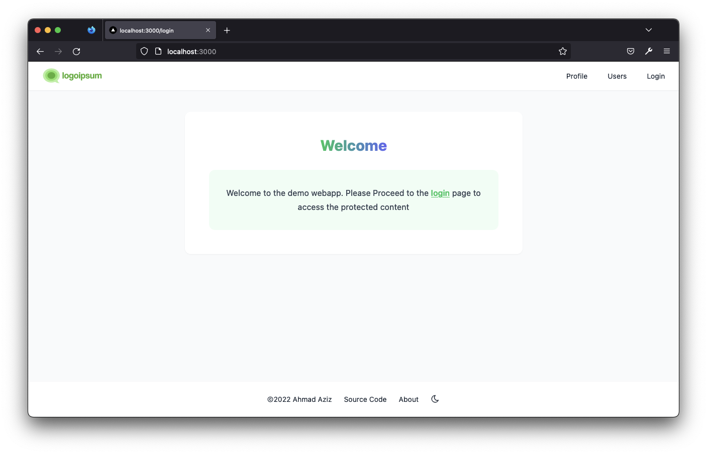
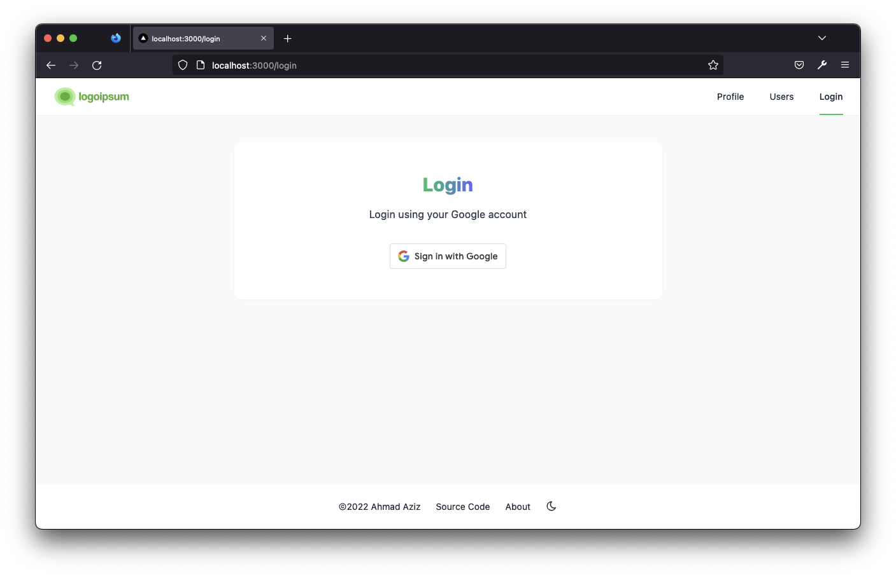
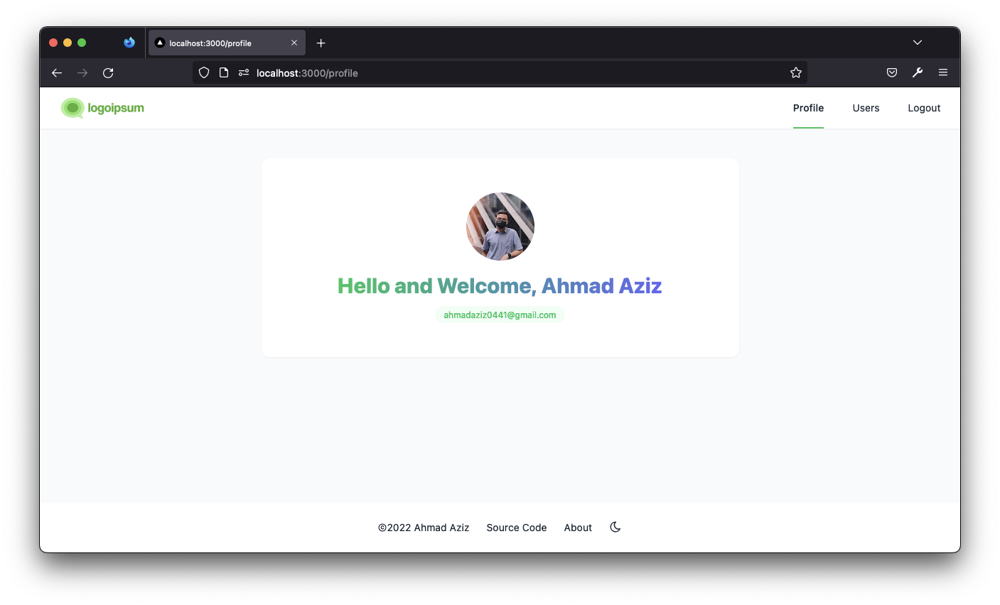
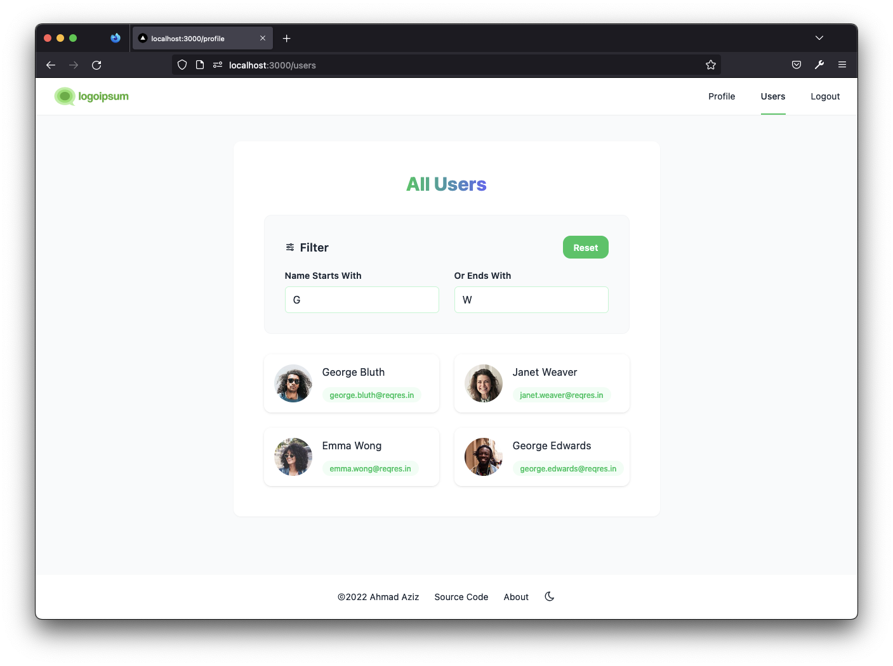
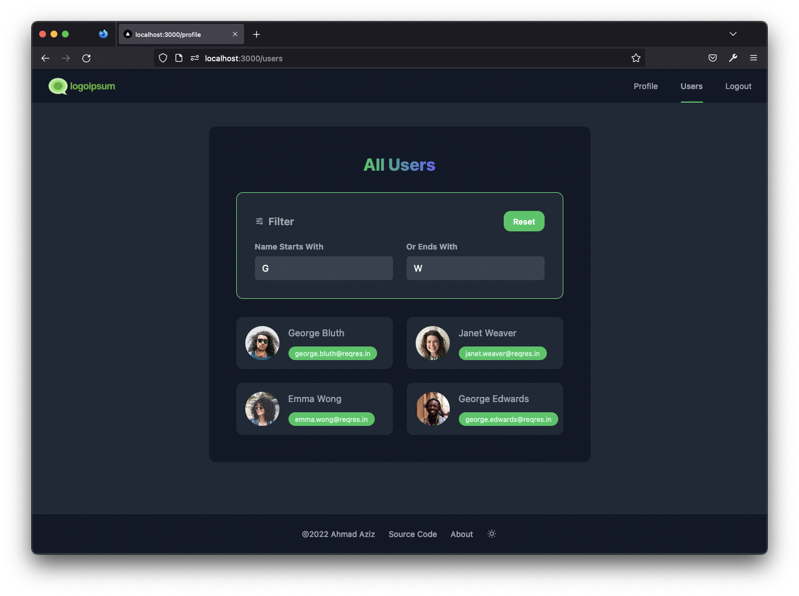
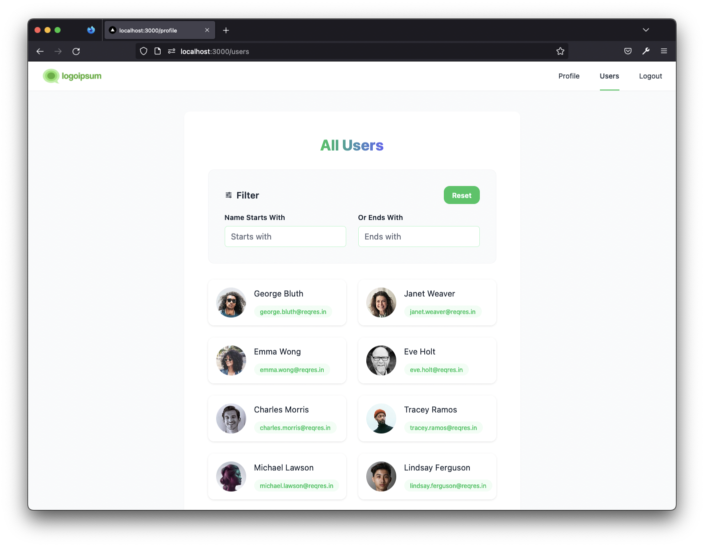

Zwebapp - This is a demo webapp developed by Ahmad Aziz (ahmadaziz97@live.com) 💫 Powered by Next.js + Redux + Google
Oauth 2 + Tailwind CSS + Typescript

## Running Project

Firstly clone and install all the dependencies:

```bash
git clone https://github.com/densityx/zwebapp.git

yarn
# or
npm install
```

Then run the development server:

```bash
npm run dev
# or
yarn dev
```

## Production

View the project live in production

- [Vercel](https://zwebapp.vercel.app/login)
- [AWS Amplify Hosting](https://main.d3jhhsbjeu44ul.amplifyapp.com/)

## Env config

The environment config can be found in the .env file. The .env file is included with the credentials as to ease the
running of the project locally. If you do prefer to use your own CLIENT_ID and CLIENT_SECRET just replace the default
value.

```dotenv
NEXT_PUBLIC_ENV="development"
NEXT_PUBLIC_REACT_APP_GOOGLE_CLIENT_ID=
NEXT_PUBLIC_AES_SECRET=
```

## Run Test

To run the test, execute the command below.

```bash
yarn test
```

## Screenshots Preview






