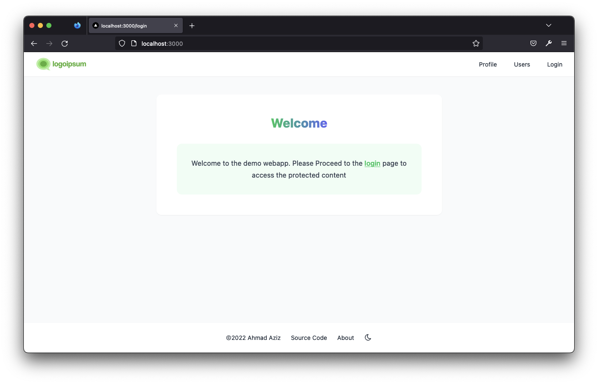
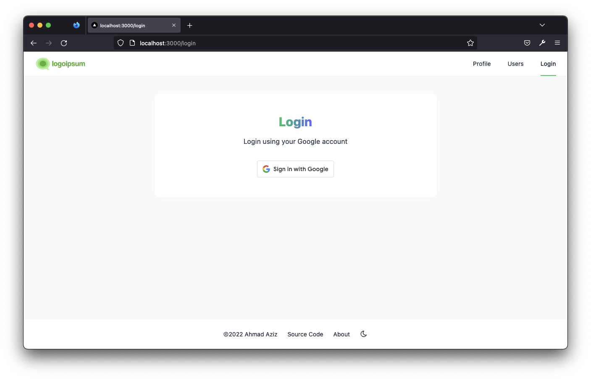
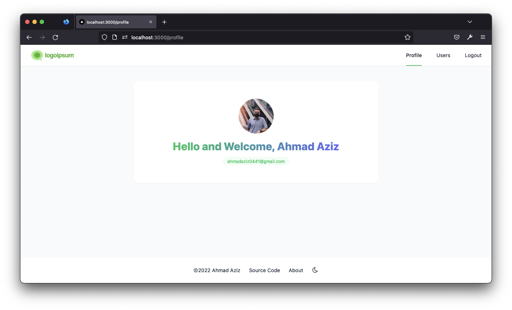
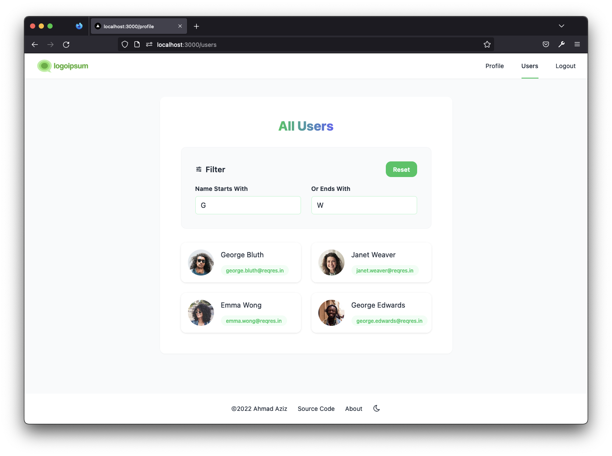
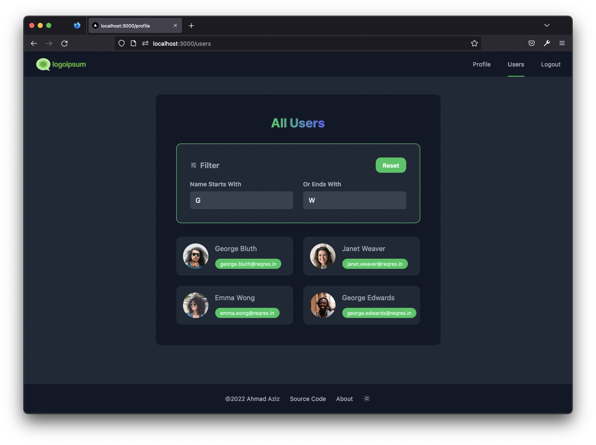
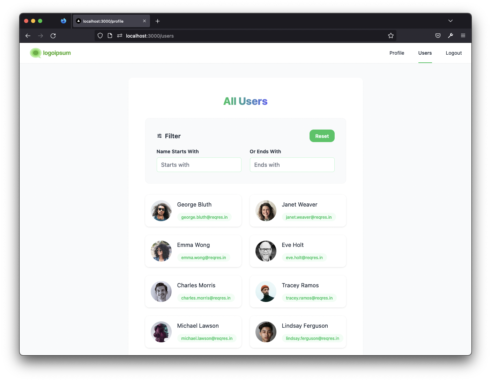

Zwebapp - This is a demo webapp developed by Ahmad Aziz (ahmadaziz97@live.com) 💫  Powered by Next.js + Redux + Google Oauth 2 + Tailwind CSS + Typescript

## Running Project

Firstly clone and install all the dependencies:

```bash
git clone https://github.com/densityx/zwebapp.git

yarn
# or
npm install
```

Then run the development server:
```bash
npm run dev
# or
yarn dev
```

## Production
View the project live in production
- [Vercel](https://zwebapp.vercel.app/login)
- [AWS Amplify Hosting](https://main.d3jhhsbjeu44ul.amplifyapp.com/) 

## Screenshots Preview





